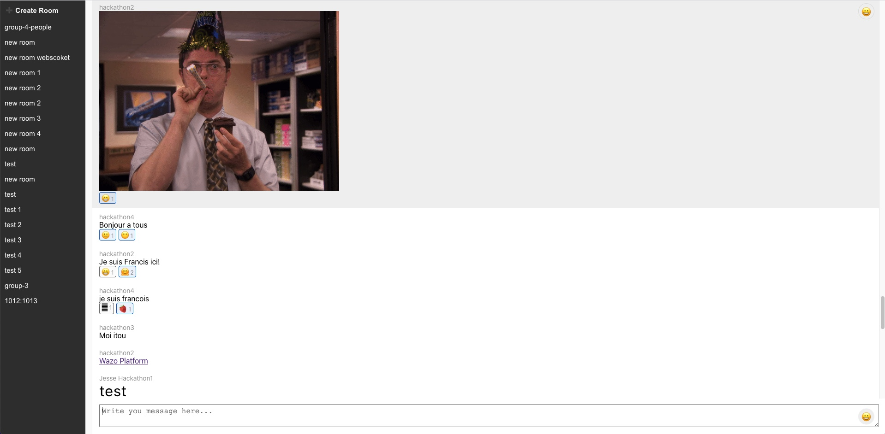
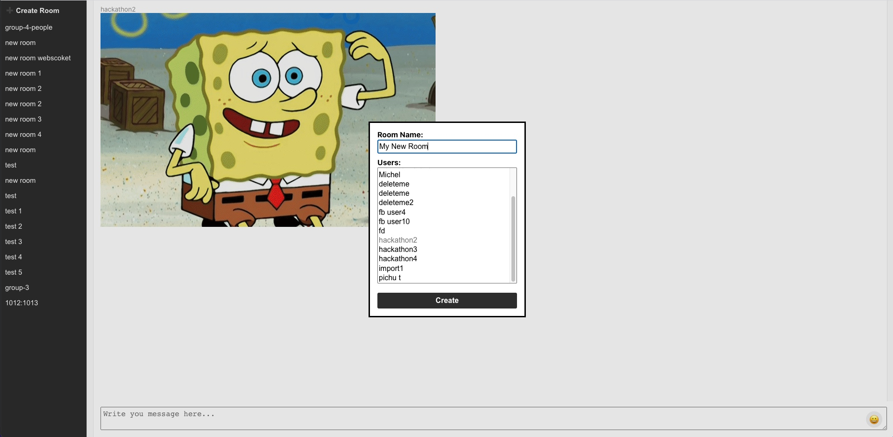
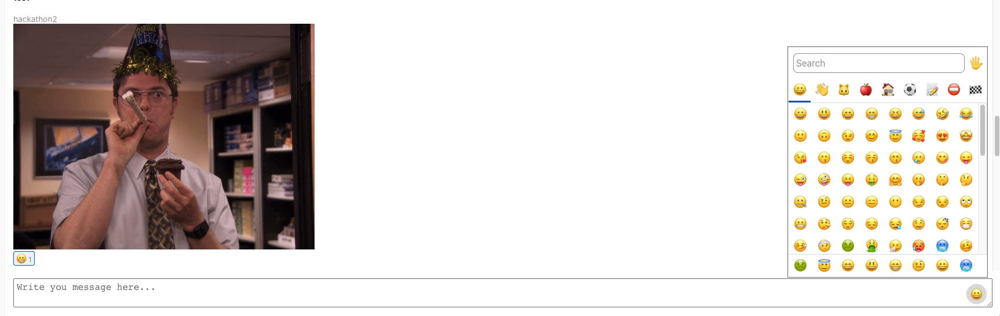

## Introduction

> 🔔 This project does not work with released wazo-platform versions. Patches are needed to make it works.

This project have been built during the Wazo Hackathon 2022.

The main objective of the team was to explore :
- Implement group chat features, markdown support and reactions.
- Create a bridge between Wazo Stack and [Matrix Framework](https://github.com/matrix-org)

Here are some screenshots of the app we created.

| Markdown Support | Room Creation | Emojis & Reactions |
|---|---|---|
|  |  |  |

## Available Scripts

In the project directory, you can run:

### `npm install`

Will install all dependencies required to run the projet.

### `npm dev` or `npm start`

Runs the app in the development mode. 
Open [http://localhost:3000](http://localhost:3000) to view it in the browser.

The page will reload if you make edits. 

### `npm run build`

Builds the app for production to the `dist` folder. 
It correctly bundles Solid in production mode and optimizes the build for the best performance.

The build is minified and the filenames include the hashes. 
Your app is ready to be deployed!

## Deployment

You can deploy the `dist` folder to any static host provider (netlify, surge, now, etc.)
